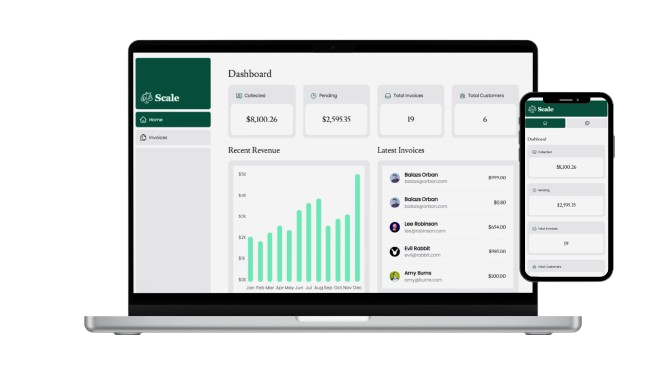
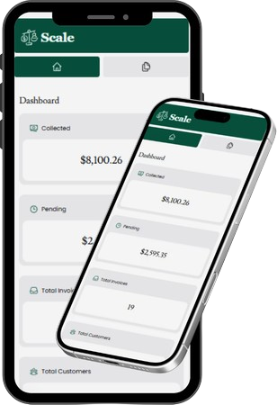

# 📊 Next.js Enterprise Analytics Dashboard

A high-performance, full-stack administrative interface built with the Next.js 15 App Router. This project serves as a showcase for modern web architecture, featuring real-time data visualization and optimized server-side rendering.

## Screenshots

### Desktop View

### Mobile View

[🔗 **Live Demo**](https://nextjs-dashboard-example-maziz.vercel.app/dashboard)

## 🛠 Tech Stack
- **Framework:** Next.js 15 (App Router)
- **Language:** TypeScript
- **Database:** PostgreSQL (Vercel Postgres)
- **Styling:** Tailwind CSS
- **Components:** Custom UI with Heroicons
- **Deployment:** Vercel

## 🚀 Key Engineering Features
- **Partial Prerendering (PPR):** Combined static shell with dynamic data holes for instant loading.
- **Server Actions:** Securely handled data mutations without traditional API endpoints.
- **Streaming & Suspense:** Granular loading states for individual dashboard cards to prevent page-blocking.
- **Optimized SQL:** Manual query optimization for PostgreSQL to handle high-volume data retrieval.

## 📈 What's Inside?
- **Revenue Analytics:** Interactive charts for financial tracking.
- **Customer Management:** Full CRUD operations for customer records.
- **Invoice Tracking:** Advanced filtering and status management for enterprise billing.